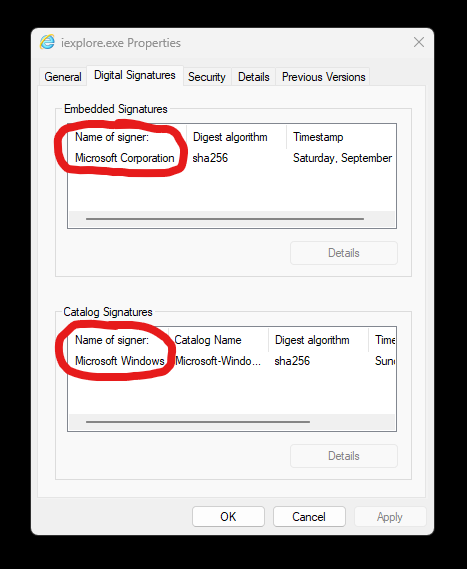

# Windows-File-Signers-Getter
 
Get the name(s) of the organization(s) signing Windows executables via embedded signatures and catalog signatures. This can be used by Anti-Virus to whitelist processes that has a valid signature from a trusted company.

